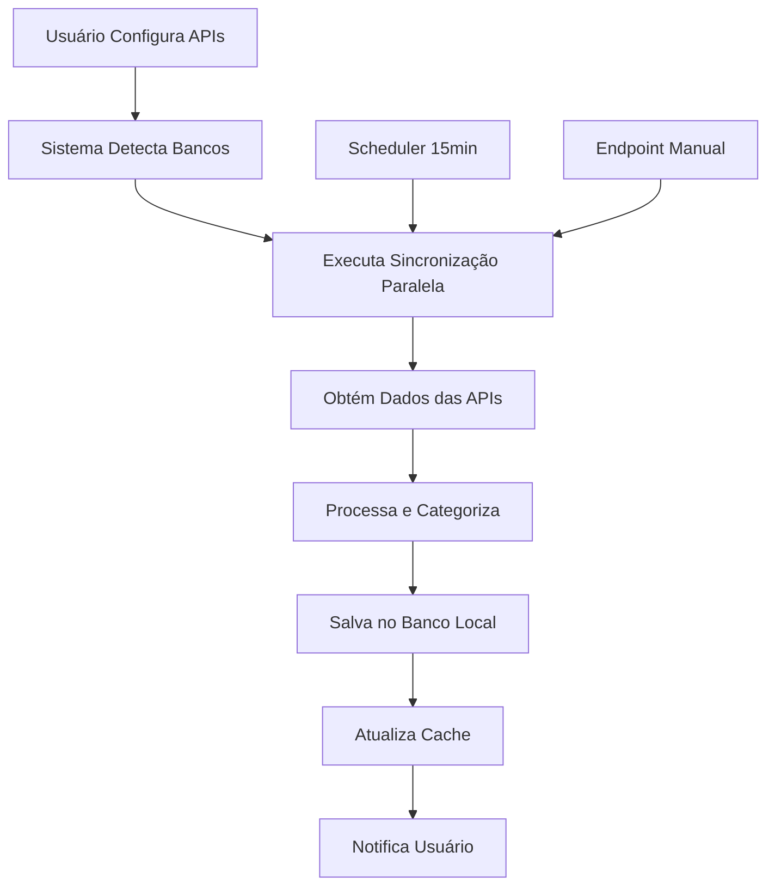

# 🔄 Sincronização Automática de Dados Financeiros - ConsumoEsperto

## 📋 Visão Geral

O ConsumoEsperto agora implementa um sistema de **sincronização automática completa** que obtém todos os dados financeiros diretamente das APIs bancárias, eliminando a necessidade de inserção manual de dados.

## ✨ **O Que É Sincronizado Automaticamente**

### **🏷️ Categorias**
- **Origem**: Extraídas automaticamente das transações bancárias
- **Categorização**: Baseada em descrição, MCC (Merchant Category Code) e tipo de transação
- **Exemplos**: Alimentação, Transporte, Saúde, Entretenimento, Educação
- **Cores e Ícones**: Gerados automaticamente para cada categoria

### **💳 Transações**
- **Origem**: APIs bancárias em tempo real
- **Dados**: Descrição, valor, data, categoria, cartão utilizado
- **Categorização**: Automática baseada em inteligência artificial
- **Frequência**: Sincronização a cada 15 minutos

### **📊 Faturas**
- **Origem**: APIs dos cartões de crédito
- **Dados**: Valor total, valor pago, status, datas de vencimento
- **Controle**: Status automático (PENDENTE, PAGA, VENCIDA)
- **Histórico**: Todas as faturas dos últimos meses

### **🛒 Compras Parceladas**
- **Origem**: APIs bancárias
- **Dados**: Descrição, valor total, número de parcelas, valor da parcela
- **Parcelas**: Criadas automaticamente com datas de vencimento
- **Controle**: Status de cada parcela individual

### **💳 Cartões de Crédito**
- **Origem**: APIs bancárias
- **Dados**: Limite, limite disponível, datas de fechamento e vencimento
- **Atualização**: Saldos em tempo real
- **Bandeiras**: Detectadas automaticamente

## 🚀 **Como Funciona**

### **1. Configuração das APIs Bancárias**
```bash
# Acesse a tela de configuração
http://localhost:8080/bank-config.html

# Configure suas credenciais para cada banco:
# - Mercado Pago
# - Itaú
# - Inter
# - Nubank
```

### **2. Sincronização Automática**
- **Frequência**: A cada 15 minutos
- **Processo**: Paralelo para múltiplos bancos
- **Cache**: 15 minutos para evitar consultas desnecessárias
- **Tratamento de Erros**: Retry automático e fallback

### **3. Categorização Inteligente**
```java
// Exemplo de categorização automática
"Supermercado Extra" → "Alimentação"
"Uber Viagem" → "Transporte"
"Netflix Assinatura" → "Entretenimento"
"Farmácia São João" → "Saúde"
```

## 🔧 **Endpoints da API de Sincronização**

### **Sincronização Completa**
```http
POST /api/financial-sync/sync-all
Authorization: Bearer {JWT_TOKEN}
```

### **Sincronização Específica**
```http
POST /api/financial-sync/sync-categories      # Apenas categorias
POST /api/financial-sync/sync-transactions    # Apenas transações
POST /api/financial-sync/sync-invoices        # Apenas faturas
POST /api/financial-sync/sync-credit-cards    # Apenas cartões
POST /api/financial-sync/sync-installment-purchases # Apenas compras parceladas
```

### **Controle e Monitoramento**
```http
GET  /api/financial-sync/status               # Status da sincronização
POST /api/financial-sync/force-sync           # Força sincronização (ignora cache)
GET  /api/financial-sync/health               # Health check do serviço
```

## 📊 **Estrutura dos Dados Sincronizados**

### **Transação Bancária → Transação Local**
```json
{
  "description": "Supermercado Extra",
  "amount": 150.50,
  "date": "2024-01-15",
  "mcc": "5411",
  "type": "purchase"
}
```

**Converte para:**
```json
{
  "id": 1,
  "descricao": "Supermercado Extra",
  "valor": 150.50,
  "tipo_transacao": "DESPESA",
  "data_transacao": "2024-01-15",
  "categoria": {
    "nome": "Alimentação",
    "cor": "#FF6B6B",
    "icone": "restaurant"
  }
}
```

### **Fatura Bancária → Fatura Local**
```json
{
  "month": 1,
  "year": 2024,
  "totalAmount": 1250.75,
  "paidAmount": 0.00,
  "status": "PENDING",
  "dueDate": "2024-02-10"
}
```

**Converte para:**
```json
{
  "id": 1,
  "mes": 1,
  "ano": 2024,
  "valor_total": 1250.75,
  "valor_pago": 0.00,
  "status": "PENDENTE",
  "data_vencimento": "2024-02-10"
}
```

## 🎯 **Vantagens do Sistema Automático**

### **✅ Para o Usuário**
- **Dados sempre atualizados** em tempo real
- **Zero esforço** para manter informações
- **Categorização automática** inteligente
- **Histórico completo** de todas as transações
- **Alertas automáticos** de vencimentos

### **✅ Para o Sistema**
- **Integridade dos dados** garantida
- **Performance otimizada** com cache inteligente
- **Escalabilidade** para múltiplos usuários
- **Tratamento robusto** de erros
- **Monitoramento completo** do processo

## 🔄 **Fluxo de Sincronização**



## 🚨 **Tratamento de Erros**

### **Erro de API Bancária**
```java
try {
    List<Map<String, Object>> transacoes = getTransactionsFromBank(auth);
    // Processa transações
} catch (Exception e) {
    log.warn("Erro ao obter transações do banco {}: {}", 
             auth.getTipoBanco(), e.getMessage());
    // Continua com outros bancos
}
```

### **Erro de Categorização**
```java
// Fallback para categoria padrão
if (categoria == null) {
    categoria = "Outros";
}
```

### **Erro de Conexão**
- **Retry automático** com delay exponencial
- **Fallback** para dados em cache
- **Notificação** para o usuário

## 📱 **Interface do Usuário**

### **Dashboard de Sincronização**
- **Status**: Última sincronização, próxima sincronização
- **Estatísticas**: Total de dados sincronizados
- **Controles**: Sincronização manual, forçar sincronização
- **Logs**: Histórico de sincronizações

### **Configuração de APIs**
- **Credenciais**: Client ID, Client Secret, User ID
- **Teste de Conexão**: Verifica se as APIs estão funcionando
- **Status**: Ativo/Inativo, última atualização

## 🔒 **Segurança e Privacidade**

### **Autenticação**
- **JWT Tokens** obrigatórios para todos os endpoints
- **Isolamento por usuário** - cada usuário vê apenas seus dados
- **Validação de permissões** para operações administrativas

### **Criptografia**
- **Credenciais bancárias** criptografadas no banco
- **Tokens OAuth2** armazenados com segurança
- **Comunicação HTTPS** com todas as APIs

### **Auditoria**
- **Log de todas as operações** de sincronização
- **Histórico de mudanças** nos dados
- **Rastreamento de erros** e tentativas de retry

## 📈 **Performance e Otimização**

### **Cache Inteligente**
```java
// Cache por usuário com TTL de 15 minutos
private final Map<String, SyncCacheEntry> syncCache = new HashMap<>();
private static final long CACHE_TTL_MS = 15 * 60 * 1000;
```

### **Processamento Paralelo**
```java
// Executor com pool de 4 threads para múltiplos bancos
private final ExecutorService executorService = Executors.newFixedThreadPool(4);
```

### **Índices Otimizados**
```sql
-- Índices para consultas rápidas
CREATE INDEX idx_transacoes_usuario_data ON transacoes(usuario_id, data_transacao);
CREATE INDEX idx_faturas_cartao_status ON faturas(cartao_credito_id, status);
CREATE INDEX idx_categorias_usuario_ativo ON categorias(usuario_id, ativo);
```

## 🧪 **Testes e Validação**

### **Testes Unitários**
```java
@Test
public void testSyncCategoriesFromBanks() {
    // Testa sincronização de categorias
}

@Test
public void testCategorizationLogic() {
    // Testa lógica de categorização
}
```

### **Testes de Integração**
```java
@Test
public void testFullSyncProcess() {
    // Testa processo completo de sincronização
}
```

### **Testes de Performance**
```java
@Test
public void testSyncPerformance() {
    // Testa performance da sincronização
}
```

## 🔮 **Funcionalidades Futuras**

### **Próximas Versões**
- [ ] **Machine Learning** para categorização mais inteligente
- [ ] **Notificações push** de mudanças importantes
- [ ] **Sincronização em tempo real** via WebSockets
- [ ] **Análise preditiva** de gastos
- [ ] **Integração com mais bancos** brasileiros

### **Melhorias Planejadas**
- [ ] **Dashboard avançado** com métricas de sincronização
- [ ] **Configuração de regras** de categorização personalizadas
- [ ] **Backup automático** dos dados sincronizados
- [ ] **Relatórios de sincronização** detalhados

## 📚 **Recursos Adicionais**

### **Documentação das APIs Bancárias**
- [Mercado Pago Developers](https://developers.mercadopago.com/)
- [Itaú Open Banking](https://openbanking.itau.com.br/)
- [Inter Open Banking](https://cdp.openbanking.bancointer.com.br/)
- [Nubank API](https://developers.nubank.com.br/)

### **Exemplos de Uso**
```bash
# Sincronizar todos os dados
curl -X POST http://localhost:8080/api/financial-sync/sync-all \
  -H "Authorization: Bearer YOUR_JWT_TOKEN"

# Verificar status
curl -X GET http://localhost:8080/api/financial-sync/status \
  -H "Authorization: Bearer YOUR_JWT_TOKEN"
```

### **Suporte e Contato**
- **Issues**: Abra uma issue no repositório
- **Documentação**: Consulte este README
- **Comunidade**: Participe das discussões

---

## 🎉 **Resumo**

O sistema de **sincronização automática** do ConsumoEsperto representa uma revolução na gestão financeira pessoal:

- ✅ **Zero esforço manual** para manter dados atualizados
- ✅ **Dados em tempo real** das APIs bancárias
- ✅ **Categorização inteligente** automática
- ✅ **Performance otimizada** com cache e processamento paralelo
- ✅ **Segurança robusta** com autenticação e criptografia
- ✅ **Escalabilidade** para múltiplos usuários e bancos

**ConsumoEsperto** - Transformando a gestão financeira com automação inteligente! 🚀
