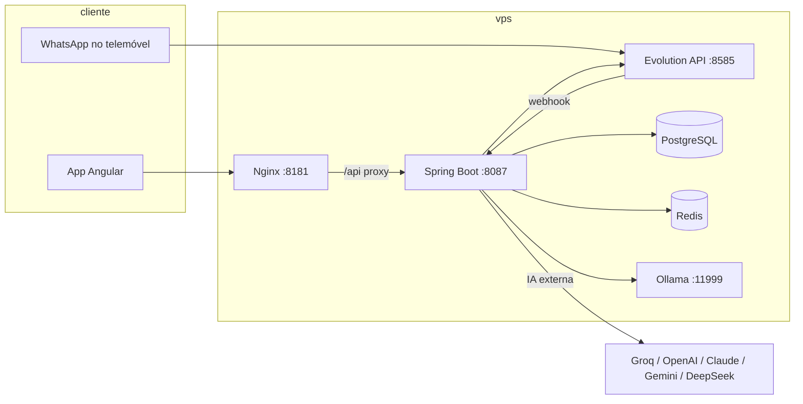

# ConsumoEsperto — Visão geral do sistema

Documento de referência do que o produto faz hoje: arquitetura, telas, APIs, WhatsApp (J.A.R.V.I.S.) e deploy.

**Última revisão:** junho/2026 · **Fonte viva do catálogo de funcionalidades:** `WhatsAppAppParityService.java` e `GET /api/whatsapp/paridade`.

---

## 1. O que é

**ConsumoEsperto** é uma aplicação de finanças pessoais com:

- **App web** (Angular) — dashboard, lançamentos, cartões, faturas, metas, orçamentos, relatórios.
- **Assistente J.A.R.V.I.S.** — linguagem natural no **WhatsApp** (Evolution API) e no **chat IA** do dashboard (mesmo motor).
- **Automação proativa** — importação de PDF (fatura/contracheque), OCR de cupom, protocolos de contenção (tetos), Modo Viagem (Google Calendar), score, previsões.

O utilizador pode usar **app**, **WhatsApp** ou **ambos**; os dados partilham a mesma base (PostgreSQL).

---

## 2. Arquitetura



| Camada | Tecnologia |
|--------|------------|
| Frontend | Angular (standalone), Material, Chart.js, Nginx em produção |
| Backend | Spring Boot 3, Java 17, JPA, Flyway, JWT |
| WhatsApp | Evolution API (`evoapicloud/evolution-api`) |
| IA | Ordem fixa: Groq → OpenAI → Claude → Gemini → DeepSeek → Ollama |
| Dados | PostgreSQL (+ pgvector para memória semântica / RAG) |
| Cache Evolution | Redis |

---

## 3. Portas e ambientes

### Produção (Docker Compose na VPS)

| Serviço | Porta host | Documentação |
|---------|------------|--------------|
| Frontend | **8181** | [`docker/README.md`](../docker/README.md) |
| Backend | **8087** | idem |
| Evolution | **8585** | idem |
| PostgreSQL | **5439** | idem |
| Ollama | **11999** | idem |

Produção típica: `https://consumoesperto.brucew07.com.br` (proxy reverso → 8181/8087).

### Desenvolvimento local (Windows)

| Serviço | Porta | Documentação |
|---------|-------|--------------|
| Evolution (Node) | **18080** | [`CONFIGURACAO_AMBIENTE.md`](../CONFIGURACAO_AMBIENTE.md) |
| Backend | **18081** | idem |
| Frontend | **14200** | idem |

Scripts PowerShell: `scripts/subir-stack.ps1` (stack completa), `scripts/run-backend-dev-evolution.ps1`, `scripts/parar-servicos.ps1`.  
Evolution Node: `npm run start:prod` em `tools/evolution-api` · Frontend: `npm start` em `frontend` (porta **14200**).  
Detalhes: [`CONFIGURACAO_AMBIENTE.md`](../CONFIGURACAO_AMBIENTE.md).

---

## 4. Telas do app (rotas Angular)

Definidas em `frontend/src/app/app.routes.ts`.

| Rota | Menu / função |
|------|----------------|
| `/dashboard` | Resumo financeiro, gráficos, chat IA, protocolos JARVIS (contenção, Modo Viagem), score |
| `/transacoes` | Despesas e receitas |
| `/contas` | Contas bancárias e transferências |
| `/cartoes` | Cartões de crédito |
| `/faturas` | Faturas abertas/fechadas e lançamentos |
| `/categorias` | Categorias de classificação |
| `/orcamentos` | Limites mensais por categoria |
| `/metas` | Metas financeiras e simulador |
| `/renda` | Contracheques PDF e histórico de renda |
| `/importacoes-pendentes` | Confirmar PDFs de fatura importados |
| `/relatorios` | Relatórios e exportação PDF |
| `/simulacoes` | Simulação de compras / prazo |
| `/investimentos` | Sugestões de investimento (Selic, IPCA, etc.) |
| `/perfil` | Dados pessoais, despesas fixas, Google Calendar, tratamento J.A.R.V.I.S. |
| `/whatsapp-config` | Vincular número, QR Evolution, **catálogo app ↔ WhatsApp** |
| `/familia` | Grupo familiar, convites, orçamentos partilhados, balanço racha-contas — ver [`MODULO_FAMILIA.md`](MODULO_FAMILIA.md) |
| `/assinaturas` | Assinaturas e despesas recorrentes (Netflix, Spotify, etc.) |
| `/score` | Pontuação e nível |
| `/login`, `/register` | Autenticação |

---

## 5. J.A.R.V.I.S. e WhatsApp

### Fluxo de mensagens

1. Utilizador envia texto, áudio, imagem ou PDF no WhatsApp.
2. **Evolution API** recebe e chama o webhook: `POST /api/public/evolution/webhook`.
3. **`WhatsAppCommandService`** processa:
   - pré-processadores (ajuda, cartões, gestão proativa, estados pendentes `sim`/`não`);
   - **NLP** (`OpenAiService.parseCommand`) com fallback entre provedores de IA;
   - execução do comando (`CREATE_EXPENSE`, `CREATE_META`, etc.).
4. Resposta formatada por **`JarvisProtocolService`**, assinada: `J.A.R.V.I.S. | ConsumoEsperto 🚀`.

### O mesmo motor no app

`POST /api/ia-chat` → `processWebCommand` → **mesmo** `processJarvisCommand` (inclui estados pendentes em memória).

### Vincular WhatsApp (só no app)

Página **`/whatsapp-config`**:

- `POST /api/usuarios/whatsapp/vincular`
- `GET /api/usuarios/whatsapp/evolution-connection-status`
- `POST /api/usuarios/whatsapp/evolution-pairing-refresh`
- QR Code / desligar / desvincular

### Ajuda no WhatsApp

Comandos: **`ajuda`**, **`menu`**, **`ajuda cartões`**, etc.  
Conteúdo gerado a partir do catálogo em `WhatsAppAppParityService`.

### Tipos de entrada no WhatsApp

| Tipo | Comportamento |
|------|----------------|
| Texto | Comandos em linguagem natural |
| Áudio | Transcrição (Groq) → texto |
| Foto | OCR cupom fiscal → confirmação `sim`/`não` |
| PDF | Fatura de cartão ou contracheque → varredura → confirmação |
| URL NFC-e | Leitura automática de nota fiscal |

---

## 6. Paridade app ↔ WhatsApp

Legenda de canais no catálogo:

| Canal | Significado |
|-------|-------------|
| **BOTH** | Disponível no app e no WhatsApp (ou chat IA) |
| **WHATSAPP_ONLY** | Só no bot (ex.: OCR cupom, áudio, memória «anote isso») |
| **APP_ONLY** | Só no app (ex.: vínculo QR, score, família) |

### Funcionalidades BOTH (resumo)

| Área | App | WhatsApp (exemplos) |
|------|-----|---------------------|
| Despesas / receitas | `/transacoes` | «gastei 45,90 no mercado» |
| Contas | `/contas` | «cria conta Nubank corrente saldo 1500» |
| Cartões | `/cartoes` | «cartão Nubank final 1234 vence dia 10» |
| Faturas | `/faturas` + importações | PDF no chat ou app |
| Categorias | `/categorias` | «cria categoria Pets» |
| Orçamentos | `/orcamentos` | «orçamento 800 em Alimentação» |
| Metas | `/metas` | «cadastra meta viagem 8000 15%» |
| Renda | `/renda` | PDF contracheque ou texto de salário |
| Despesas fixas | `/perfil` | «salve essa despesa fixa de 250…» |
| Relatórios | `/relatorios` | «gera PDF de maio» |
| Simulações | `/simulacoes` | «quero comprar notebook 4500…» |
| Investimentos | `/investimentos` | «onde investir o saldo?» |
| Previsão do mês | `/dashboard` | «como vou fechar o mês?» |
| Modo Viagem | Dashboard + Calendar no perfil | `sim`/`não` após sugestão Cronos |
| Chat IA | Painel no dashboard | Linguagem natural |

### Só WhatsApp

- Cupom / nota (foto OCR)
- Comandos por voz (áudio)
- Memória semântica: «Jarvis, anote isso: …»

### Só app

- Vincular WhatsApp / QR Evolution
- Score e nível
- Família (grupo, convites, orçamentos partilhados) — [`MODULO_FAMILIA.md`](MODULO_FAMILIA.md)
- Assinaturas recorrentes (`/assinaturas`)

**Ver catálogo completo:** app → **WhatsApp** → «O que fazer em cada tela», ou API `GET /api/whatsapp/paridade`.

---

## 7. Protocolos proativos J.A.R.V.I.S.

### Importação de fatura PDF

1. PDF (WhatsApp ou app) → extração IA → lista de lançamentos.
2. Varredura com alertas (juros, saltos de gasto).
3. Utilizador confirma: **«Autoriza a gravação nos livros?»** (`sim`/`não`).
4. Após confirmar → lançamentos no cartão/fatura.
5. Sugestões de **protocolo de contenção** (tetos) — fila `sim`/`não` no WhatsApp ou aceitar no **dashboard**.

Serviços: `FaturaPdfImportService`, `ContencaoJarvisService`.  
API app: `/api/importacoes/faturas/*`.

### Protocolo de contenção

Detecta aumento de gasto (mercado, combustível, restaurante) vs média dos 3 meses anteriores; sugere teto mensal (orçamento).

| Canal | Como confirmar |
|-------|----------------|
| WhatsApp | Fila sequencial `sim`/`não` após importar fatura |
| App | Dashboard → «Protocolos sugeridos» → aceitar / ignorar |

API: `GET/POST /api/jarvis/sugestoes-contencao/*`  
Ao aceitar, cria orçamento; cria categoria padrão (ex. Alimentação) se necessário.

### Modo Viagem (Cronos)

1. Google Calendar vinculado no **perfil**.
2. Job semanal deteta eventos de viagem.
3. Sugere teto temporário → meta `[Modo Viagem]`.
4. Confirmação: WhatsApp `sim`/`não` ou painel no **dashboard**.

API: `GET/POST /api/jarvis/modo-viagem/*`

### Contracheque PDF

Upload → extração → confirmação → atualiza renda e lança receita «Salário».  
App: `/renda` · API: `/api/renda-config/contracheques/*`

### Cupom (OCR)

Foto no WhatsApp → leitura → confirmação `sim`/`não` → despesa.  
No app: lançamento manual em `/transacoes`.

### Estados pendentes (`sim`/`não`)

O bot mantém conversas em memória por utilizador, por exemplo:

- confirmação de fatura, contracheque, cupom;
- receita automática no dia de pagamento;
- filas de contenção e Modo Viagem;
- simulação / gravação de meta;
- gestão proativa numerada (apagar/editar entidades).

**Regra:** confirmações específicas (fatura, cupom, etc.) têm **prioridade** sobre filas globais. Mensagens que não são `sim`/`não` podem ser comandos normais (ex.: criar categoria).  
Concluir a mesma ação no **app** limpa o estado pendente no WhatsApp.

---

## 8. APIs REST (grupos principais)

Base: `/api` (autenticado com JWT, exceto rotas `/api/public/*` e `/api/auth/*`).

| Prefixo | Função |
|---------|--------|
| `/api/auth` | Login, registro, OAuth Google, status |
| `/api/usuarios` | Perfil, WhatsApp, preferências JARVIS |
| `/api/transacoes` | CRUD despesas/receitas |
| `/api/contas-bancarias` | Contas bancárias |
| `/api/transferencias` | Transferências entre contas |
| `/api/cartoes-credito` | Cartões |
| `/api/faturas` | Faturas e conciliação |
| `/api/importacoes/faturas` | Upload e confirmação PDF fatura |
| `/api/categorias` | Categorias |
| `/api/orcamentos` | Orçamentos e forecast |
| `/api/metas` | Metas financeiras |
| `/api/despesas-fixas` | Despesas recorrentes |
| `/api/renda-config` | Salário, contracheques |
| `/api/relatorios` | Relatórios e PDF |
| `/api/simulacoes` | Simulações |
| `/api/projecoes` | Projeções / dashboard |
| `/api/compras-parceladas` | Parcelamentos |
| `/api/score` | Pontuação |
| `/api/familia` | Grupo familiar |
| `/api/assinaturas` | Assinaturas e despesas recorrentes |
| `/api/notificacoes` | Inbox / push |
| `/api/ia-chat` | Chat IA (motor JARVIS) |
| `/api/config` | Chaves de IA por utilizador |
| `/api/jarvis` | Memória, feedback, protocolos |
| `/api/jarvis/sugestoes-contencao` | Contenção |
| `/api/jarvis/modo-viagem` | Modo Viagem |
| `/api/whatsapp/paridade` | Catálogo app ↔ WhatsApp |
| `/api/integracoes/google-calendar` | OAuth calendário |
| `/api/extrator` | Webhook comprovante PIX |
| `/api/public/evolution/webhook` | Webhook Evolution (mensagens WA) |
| `/api/backup`, `/api/exportacao` | Backup e exportação de dados |

Controllers em: `backend/src/main/java/com/consumoesperto/controller/`.

---

## 9. Inteligência artificial

### Ordem de fallback (fixa)

1. Groq  
2. OpenAI  
3. Claude (Anthropic)  
4. Gemini  
5. DeepSeek  
6. Ollama (local, contentor `ollama`)

Configuração: `.env` / variáveis no `docker-compose.yml` · por utilizador: `/api/config/ia`.

### Usos principais

| Uso | Serviço típico |
|-----|----------------|
| Interpretar comandos WhatsApp | `OpenAiService.parseCommand` |
| Extrair PDF fatura/contracheque | `DocumentoIAContextService` |
| OCR cupom / visão | Serviços de visão + Groq |
| Transcrição áudio | Groq |
| RAG / memória / insights | `CerebroSemanticoService`, pgvector |
| Respostas analíticas | `tryRespostaRagAnalitico` |

---

## 10. Frontend — modais e overlay

Diálogos Angular Material (`MatDialog`) dependem do CSS **`@angular/cdk/overlay-prebuilt.css`** (incluído em `angular.json`), z-index do overlay acima da camada de loading global (`.shell-loading-layer`) e da classe `ce-modal-open` no `<html>` para bloquear scroll da página.

**Não** adicionar hacks manuais de `pointer-events` ou wheel trap sem este CSS — causa regressões de clique em todas as telas.

Guia completo: [`FRONTEND_OVERLAY_MODAIS.md`](FRONTEND_OVERLAY_MODAIS.md).

---

## 11. Score e gamificação

Eventos (importação consistente, orçamento no verde, etc.) alimentam **`ScoreService`**.  
Visível em `/score` e no dashboard. **Não** exposto no WhatsApp.

---

## 12. Deploy na VPS

```bash
cd /opt/consumoesperto
cp docker/env.docker.example .env   # primeira vez
nano .env
git pull
docker compose build backend frontend   # evite --no-cache salvo necessidade
docker compose up -d
```

**Dica:** em VPS com pouca RAM, faça build de `backend` e `frontend` **separados**; `ng build` pode demorar 10–20 min.

Após subir Ollama pela primeira vez:

```bash
docker exec consumo_ollama ollama pull llama3.2
```

Mais detalhes e troubleshooting: [`docker/README.md`](../docker/README.md), [`docker/REVERSO_PROXY_502.md`](../docker/REVERSO_PROXY_502.md).

---

## 13. Outros documentos do repositório

| Ficheiro | Conteúdo |
|----------|----------|
| [`README.md`](../README.md) | Entrada do repositório |
| [`docs/INDICE.md`](INDICE.md) | Índice de toda a documentação |
| [`CONFIGURACAO_AMBIENTE.md`](../CONFIGURACAO_AMBIENTE.md) | Setup local Windows, Evolution, Postgres, webhook |
| [`docker/README.md`](../docker/README.md) | Docker Compose produção, portas, Flyway, Ollama |
| [`docs/MODULO_FAMILIA.md`](MODULO_FAMILIA.md) | Grupo familiar e partilha |
| [`docs/FRONTEND_OVERLAY_MODAIS.md`](FRONTEND_OVERLAY_MODAIS.md) | Modais e overlay CDK |
| [`docs/WHATSAPP_EVOLUTION.md`](WHATSAPP_EVOLUTION.md) | Evolution: QR, privacidade, sessão |
| [`.env.example`](../.env.example) | Variáveis de ambiente comentadas |
| [`.cursor/rules/stack-local.mdc`](../.cursor/rules/stack-local.mdc) | Regra para agentes: stack local |
| **`docs/VISAO_GERAL.md`** (este ficheiro) | Visão de produto e arquitetura |

---

## 14. Como manter este documento

1. **Novas funcionalidades visíveis ao utilizador** → atualizar `WhatsAppAppParityService.CATALOGO` (fonte da verdade) e, se relevante, esta secção 6 ou 7.
2. **Novas rotas Angular** → secção 4 (`app.routes.ts`).
3. **Novos controllers** → secção 8.
4. **Mudança de portas ou serviços Docker** → secção 3 e `docker/README.md`.

Quando em dúvida, o catálogo em **`/whatsapp-config`** no app reflete o que está em código via `GET /api/whatsapp/paridade`.
