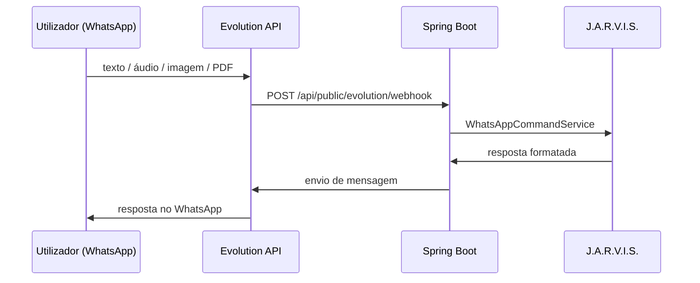

# WhatsApp — Evolution API

Integração do ConsumoEsperto com a **Evolution API** para o assistente J.A.R.V.I.S. no WhatsApp.

---

## Fluxo de mensagens



**Webhook:** `POST /api/public/evolution/webhook` (também aceite em `/api/whatsapp/webhook` em alguns ambientes).

Teste local: ficheiro [`test-webhook-local.http`](../test-webhook-local.http) (baseUrl = backend **18081** em dev).

---

## Ambientes

| Ambiente | Evolution | Backend | Pareamento QR |
|----------|-----------|---------|---------------|
| Dev local (Node) | `http://localhost:18080` | `http://localhost:18081` | App → `/whatsapp-config` |
| Docker (VPS) | `http://evolution_api:8585` (interno) · `:8585` (host) | `:8087` | `EVOLUTION_SERVER_URL` público |

### Variáveis críticas

| Variável | Uso |
|----------|-----|
| `EVOLUTION_URL` | URL que o **backend** usa para chamar a Evolution (rede interna no Docker: `http://evolution_api:8585`) |
| `EVOLUTION_SERVER_URL` / `EVOLUTION_PUBLISH` | URL **pública** (`SERVER_URL` no contentor Evolution) — necessária para QR e webhooks |
| `EVOLUTION_API_KEY` | Igual a `AUTHENTICATION_API_KEY` / `API_TOKEN` na Evolution |
| `EVOLUTION_INSTANCE` | Nome da instância (ex.: `ConsumoEsperto`) |
| `EVOLUTION_DEDICATED_INSTANCE_PER_USER` | `true` = instância `ce-u{id}` por utilizador (recomendado multi-tenant) |

Sem `SERVER_URL` correcto, `GET /instance/connect` pode devolver apenas `{"count":0}` sem QR.

### Redis (Docker)

Usar **`CACHE_REDIS_ENABLED`** + **`CACHE_REDIS_URI`** (`redis://redis:6379/0`).  
Pares só `REDIS_HOST` / `REDIS_ENABLED` não seguem o `env.example` oficial e podem causar instabilidade.

Imagem por defeito no `docker-compose.yml`: **`evoapicloud/evolution-api:latest`**.

---

## Vincular número (só no app)

Página **`/whatsapp-config`**:

1. `POST /api/usuarios/whatsapp/vincular`
2. Modal QR: polling `GET .../evolution-connection-status` e `POST .../evolution-pairing-refresh`
3. Desligar / desvincular pelos endpoints da mesma página

O browser **nunca** recebe a API key mestra da Evolution; só o backend chama a Evolution.

---

## Privacidade e notificações no telemóvel

Com `alwaysOnline` e `readMessages` activos na Evolution, o WhatsApp no telemóvel pode **deixar de notificar** (sessão «sempre online»).

Recomendações no `.env` (ver comentários em [`.env.example`](../.env.example)):

```env
EVOLUTION_ALWAYS_ONLINE=false
EVOLUTION_READ_MESSAGES=false
EVOLUTION_READ_STATUS=false
EVOLUTION_SYNC_FULL_HISTORY=false
EVOLUTION_SESSION_STICKY=true
EVOLUTION_PRIVACY_RESTART_ON_CONNECT=true
EVOLUTION_PRIVACY_SET_UNAVAILABLE=true
EVOLUTION_PRIVACY_PRESENCE_REFRESH=true
```

| Variável | Efeito |
|----------|--------|
| `EVOLUTION_ALWAYS_ONLINE=false` | Não força presença online permanente |
| `EVOLUTION_READ_MESSAGES=false` | Não marca mensagens como lidas automaticamente |
| `EVOLUTION_PRIVACY_SET_UNAVAILABLE=true` | Presença «indisponível» — essencial para notificações no telemóvel |
| `EVOLUTION_SESSION_STICKY=true` | Evita derrubar Baileys em restarts repetidos |
| `EVOLUTION_PRIVACY_RESTART_ON_CONNECT=true` | Reinício na 1.ª ligação para aplicar privacidade |

O backend aplica estas definições via serviços de integração Evolution após pareamento (ver implementação em `Evolution*` / pairing no backend).

---

## Desenvolvimento local (Evolution Node)

1. Clone em `tools/evolution-api` (ou `EVOLUTION_DIR`).
2. `npm install` e `npm run build`.
3. `scripts/sincronizar-evolution-env.ps1` alinha `.env` (porta **18080**, webhook → **18081**).
4. `npm run start:prod` na pasta da Evolution.
5. Backend com perfil `dev-evolution`: `.\scripts\run-backend-dev-evolution.ps1`.

---

## Troubleshooting

| Problema | Acção |
|----------|-------|
| QR não aparece (`{"count":0}`) | Confirmar `EVOLUTION_SERVER_URL` público; testar imagem ≥ v2.3.7; `NODE_OPTIONS=--dns-result-order=ipv4first` |
| `Connection reset by peer` | Verificar Redis `CACHE_REDIS_*`; logs do contentor `consumo_evolution` |
| Sessão cai após restart | `EVOLUTION_SESSION_STICKY=true`; não reiniciar Evolution em loop |
| Sem notificações no telemóvel | Desactivar `alwaysOnline`/`readMessages`; activar `EVOLUTION_PRIVACY_SET_UNAVAILABLE` |
| Webhook não chega ao Spring | `WEBHOOK_GLOBAL_URL` → `http://backend:8087/api/public/evolution/webhook` (Docker) ou `http://127.0.0.1:18081/...` (local) |
| Password Postgres com `@` no URI | Percent-encode na `DATABASE_CONNECTION_URI` |

Mais contexto: [`CONFIGURACAO_AMBIENTE.md`](../CONFIGURACAO_AMBIENTE.md), [`docker/README.md`](../docker/README.md).

**Última revisão:** junho/2026
